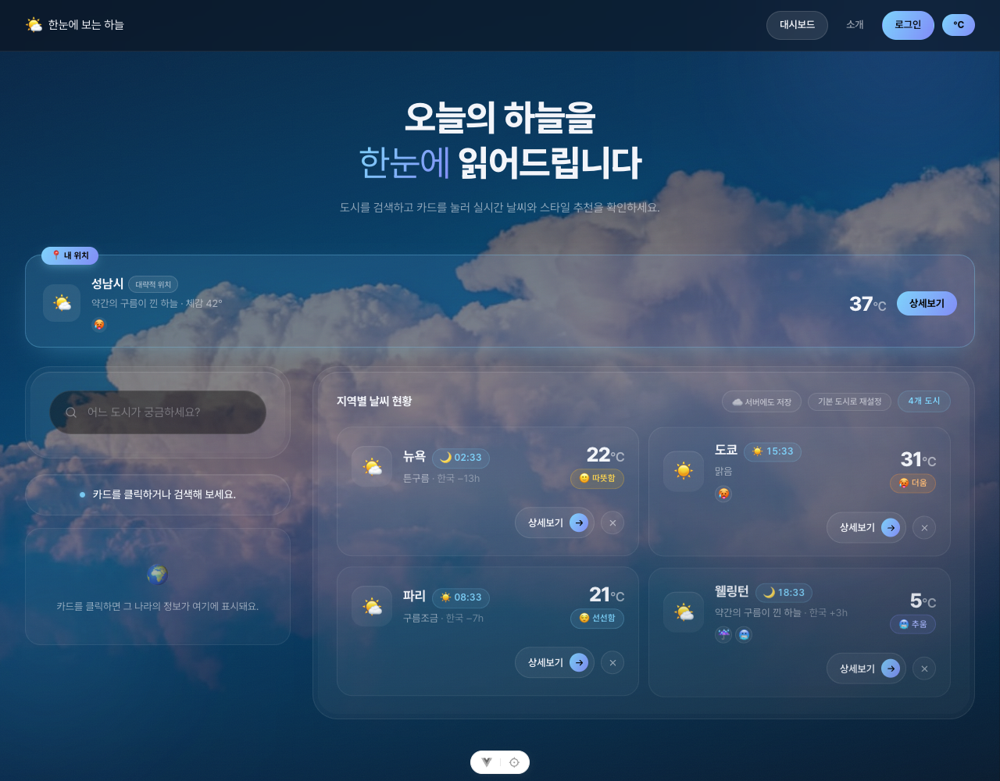
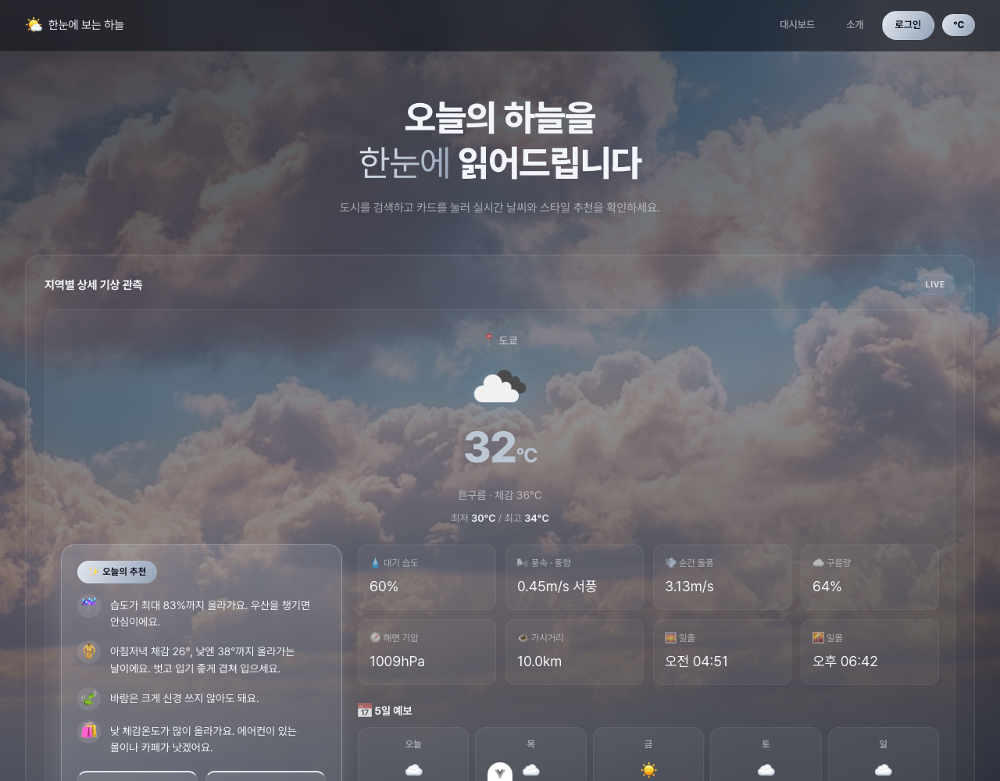
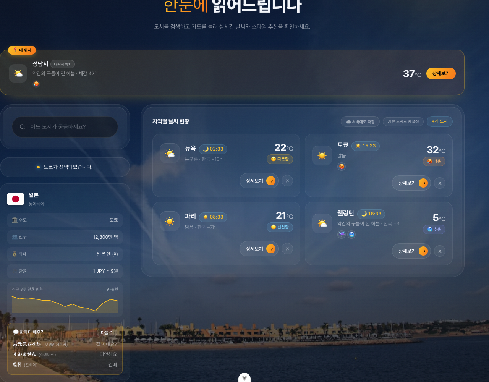
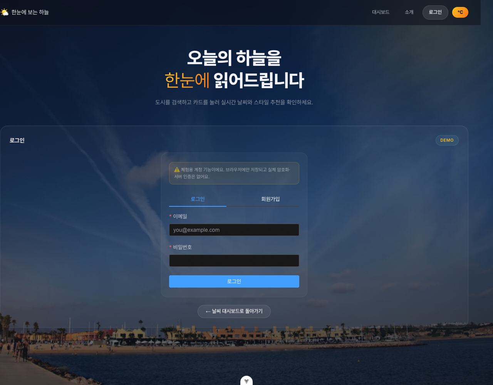
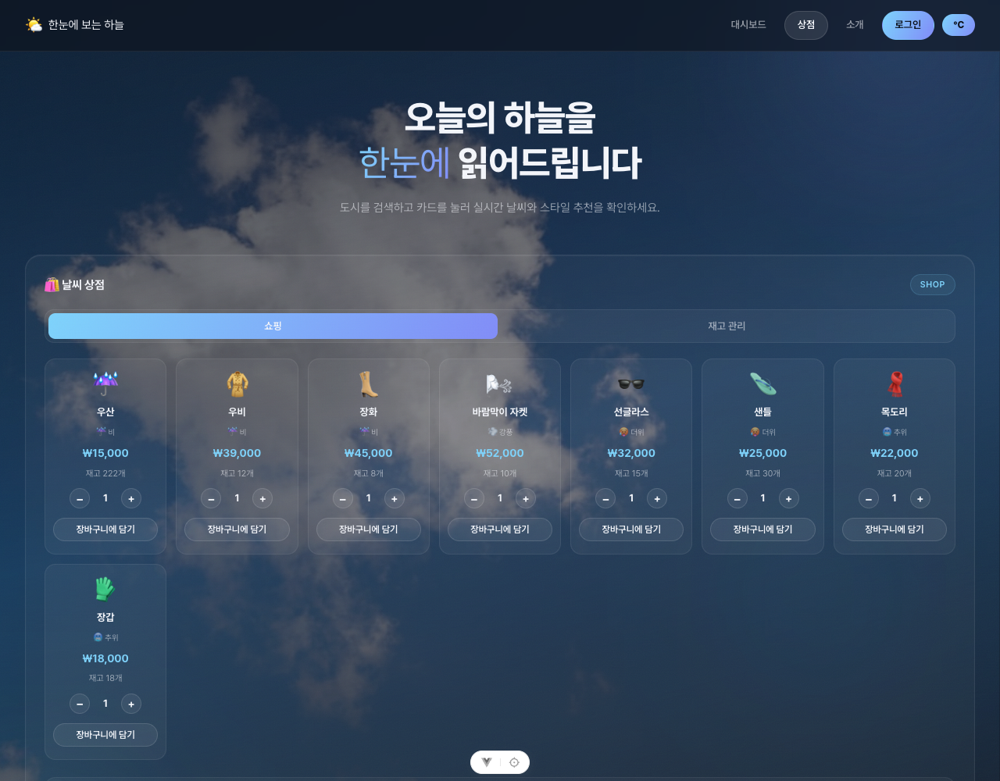
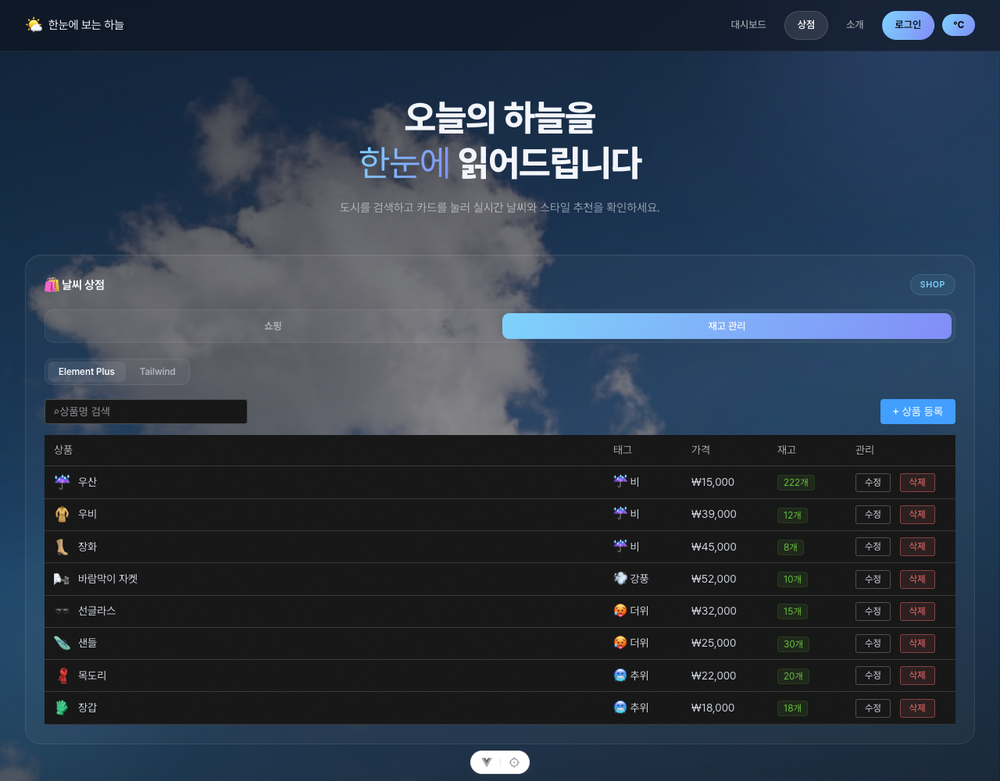
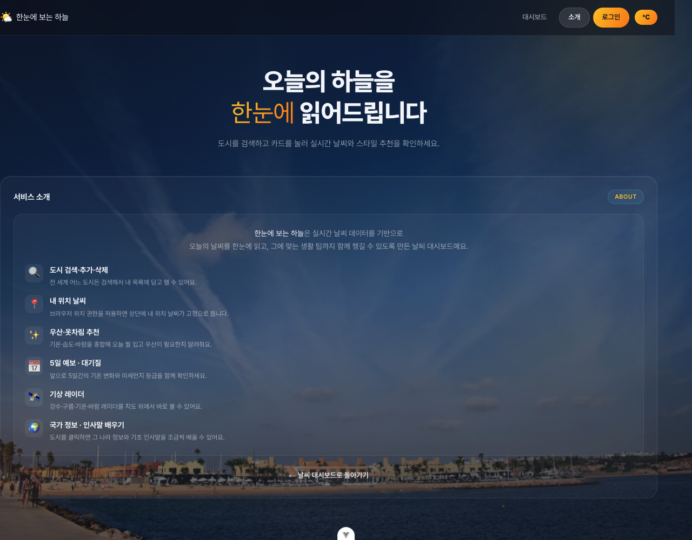

# 🌤️ 한눈에 보는 하늘

실시간 날씨 데이터를 기반으로 오늘의 날씨를 한눈에 읽고, 우산·옷차림 추천부터 대기질·환율·현지 언어까지
같이 챙길 수 있는 날씨 대시보드입니다. Vue 3 + Pinia + Vite로 만들었고, 전부 무료 API로 동작합니다.

[`vue3-playground`](https://github.com/hyun907/vue3-playground)를 기반으로 시작해, Pinia 상태관리·mock REST API·
날씨 조건별 추천 기능을 얹은 뒤, 내 위치·기상 레이더·국가 정보·환율·PWA까지 계속 확장해 온 프로젝트입니다.

## 스크린샷

| 대시보드                                    | 상세 페이지                                 |
| --------------------------------------- | -------------------------------------- |
|  |  |

| 국가 정보 패널 (환율 그래프 포함)                          | 로그인 / 회원가입                          |
| ----------------------------------------------- | ------------------------------------- |
|  |  |

| 날씨 상점 — 쇼핑 | 날씨 상점 — 재고 관리 |
| --- | --- |
|  |  |

| 서비스 소개 |
| --- |
|  |

## 주요 기능

* **도시 검색 · 추가 · 삭제** — 전 세계 도시를 검색해 내 목록에 담고 뗄 수 있습니다. 목록은 `localStorage`에 저장되어 새로고침해도 유지되고, "기본 도시로 재설정" 버튼으로 언제든 처음 상태로 되돌릴 수 있습니다.

* **도시별 날씨 메모 (CRUD)** — 상세 페이지에서 그 도시의 날씨에 대한 짧은 메모를 기분 이모지와 함께 남기고, 목록에서 확인·수정·삭제할 수 있습니다. mock-api 서버(`/api/notes`)와 배포용 브라우저 어댑터 양쪽에서 동일하게 동작합니다.

* **내 위치 날씨** — 브라우저 GPS로 내 위치 날씨를 상단에 고정 표시합니다. GPS가 실패하면 IP 기반 위치로 자동 대체되어 항상 무언가는 뜹니다.

* **섭씨 / 화씨 전환** — 헤더의 토글 버튼 하나로 화면 전체 온도 표기가 즉시 바뀝니다.

* **반응형 상세 페이지** — 넓은 화면에서는 오늘의 추천과 상세 정보(습도·예보·대기질·레이더)가 두 칼럼으로 나란히 보여 스크롤 없이 한눈에 들어오고, 좁은 화면에서는 자연스럽게 한 칼럼으로 쌓입니다.

* **오늘의 추천 (우산 · 옷차림 · 장소)** — 지금 이 순간뿐 아니라 다음 24시간(3시간 간격 8개 지점)의 기온·체감온도·습도·풍속·날씨 상태를 하루 단위로 종합해 우산 필요 여부(비가 오면 몇 시부터인지까지), 5단계 옷차림(더움\~추움, 하루 기온 차가 크면 "겹쳐 입기" 안내), 강풍 주의, 그리고 카페·몰·공원·집 중 오늘 가기 좋은 곳을 추천합니다. 카드에는 짧은 뱃지로 요약해 보여줍니다.

* **5일 예보 · 24시간 날씨** — 3시간 간격 예보를 하루 단위로 압축한 5일 예보와, 다음 24시간의 온도 변화를 선 그래프로 보여줍니다. 하루 안에도 날씨가 바뀔 수 있어 시간대별 날씨 아이콘(☀️/☁️/🌧️ 등)도 그래프 아래에 같이 표시합니다.

* **대기질(AQI)** — 좋음\~매우나쁨 5단계 등급과 PM2.5 / PM10 수치, 마스크 착용 권장 여부를 안내합니다.

* **기상 레이더** — 강수 · 구름 · 기온 · 바람 레이더를 Leaflet 지도 위에서 바로 확인합니다.

* **국가 정보 · 환율(+ 3주 그래프) · 한마디 배우기** — 카드를 클릭하면 그 나라의 국기 · 수도 · 인구 · 화폐 정보와 실시간 환율(원화 기준) + 최근 3주 환율 변화 그래프, 그리고 기초 인사말 2\~3개가 뜹니다. 영어·한국어가 아닌 언어는 한글로 발음도 같이 적어 두어(예: "오네가이시마스") 읽는 법까지 바로 알 수 있습니다. 인사말은 날짜를 시드로 매일 다른 세트로 시작해서, 매번 새로운 느낌을 줍니다.

* **날씨 배경 사진** — Unsplash API 키를 등록하면 화면 배경이 실제 날씨(맑음 / 흐림 / 비 / 눈)에 맞는 사진으로 바뀝니다. 키가 없으면 자동으로 CSS 그라디언트 테마로 대체됩니다.

* **PWA 지원** — 홈 화면에 앱처럼 설치할 수 있고, 마지막으로 본 화면은 오프라인에서도 열립니다.

* **회원가입 / 로그인 (체험용)** — Element Plus Form으로 만든 로그인·회원가입 화면입니다. ⚠️ 브라우저 `localStorage`에만 저장되는 데모 기능이라 실제 암호화나 서버 인증은 없습니다 — 폼 검증 UX와 로그인 상태에 따른 내비게이션 변화를 보여주기 위한 용도입니다.

* **서버 동기화(선택)** — "☁️ 서버에도 저장" 버튼으로 현재 목록을 백업할 수 있습니다. 로컬 개발 중엔 실제 mock API 서버에 저장되고, GitHub Pages처럼 서버가 없는 배포 환경에서는 브라우저 어댑터가 요청을 가로채 `localStorage`로 흉내 냅니다 — 어느 쪽이든 버튼은 항상 정상 동작합니다.

* **🛍️ 날씨 상점 (`/shop`)** — 우산·우비·장화·바람막이·선글라스·샌들·목도리·장갑을 수량을 조절해 장바구니에 담고 주문하면, 재고가 실제로 줄어들고 주문 내역에 남습니다. "재고 관리" 탭에서는 같은 상품 데이터를 Element Plus 테이블형과 Tailwind + Headless UI 카드형, 두 가지 스타일로 전환해 관리할 수 있습니다 — 둘 다 같은 API를 쓰므로 어느 쪽으로 고쳐도 "쇼핑" 탭에 바로 반영됩니다.

## 날씨 기반 추천 기능

`src/utils/weatherAdvice.js`가 기온·체감온도·습도·풍속·날씨상태를 받아 순수 함수로 계산합니다. AI API 없이도
오늘 하루치 예보 데이터만으로 충분히 실용적인 규칙 기반 추천이 가능합니다.

* ☔ **우산** — `ForecastStrip.vue`가 받아오는 다음 24시간(3시간 간격 8개 지점) 예보 중 비/눈 예보가 있으면
  몇 시부터인지까지 짚어주고, 강수 예보가 없어도 하루 중 습도가 한 번이라도 80%를 넘으면 여전히 권장합니다.

* 👕 **옷차림** — 하루 최저~최고 체감온도 차이가 8°C 이상이면 "겹쳐 입기"를 안내하고, 그렇지 않으면 하루 평균
  체감온도로 5단계(더움\~추움/반팔\~패딩) 중 하나를 추천합니다.

* 💨 **강풍 주의** — 하루 중 최대 풍속이 8m/s 이상이면 "짧은 치마·큰 우산 주의" 같은 실질적인 팁을 줍니다.

* 📍 **장소 추천** — 비 오는 시간이 하루의 절반을 넘으면 카페·쇼핑몰, 강풍이면 집, 체감온도가 30°C 이상이거나
  0°C 이하로 떨어지면 실내(몰/카페)를, 맑고 잔잔한 날이면 공원을 제안합니다.

`getDayAdvice()`가 위 네 가지를 한 번에 계산해 상세 페이지의 "오늘의 추천" 배너에 쓰이고, 계산된 조건 태그
(`rain`/`windy`/`hot`/`cold`)는 `src/data/styleItems.js`의 정적 카탈로그를 필터링해 우산·바람막이·선글라스·목도리
같은 구체적인 아이템도 함께 추천합니다. 예보 API 응답이 아직 없을 때는 현재 관측값 기준의 `getWeatherAdvice()`가
같은 화면을 임시로 채워, 화면이 비어 보이지 않게 합니다. 모두 서버 호출 없이 순수 클라이언트 로직이라 항상 즉시,
안정적으로 동작합니다.

## 기술 스택

* **Vue 3** (Composition API, `<script setup>`) + **Vite**

* **Pinia** — 날씨 목록 / 검색 / 내 위치 / 단위 설정 상태 관리

* **Vue Router** — 대시보드 · 상세 페이지 · 서비스 소개 라우팅

* **Axios** — 모든 외부 API 호출

* **Leaflet** — 기상 레이더 지도

* **Element Plus** — 폼(Form/Input), 삭제 확인창(Popconfirm), 토스트 알림(Message), 상세 정보(Descriptions), 세그먼트 컨트롤(Radio Button), 탭(Tabs), 테이블(Table), 다크 테마, 한국어 로케일

* **Tailwind CSS + Headless UI** — 상점 "재고 관리" 탭의 두 번째 스타일(카드형)에서만 사용. `preflight`(전역 리셋)는 빼고 유틸리티만 불러와서, 클래스를 붙이지 않은 다른 화면에는 영향이 없습니다.

* **vite-plugin-pwa** — PWA 매니페스트 · 서비스 워커

* **ESLint + oxlint + Prettier** — 코드 스타일 검사

## 사용 API

| API                                                           | 용도                                     | 키 필요 여부               |
| ------------------------------------------------------------- | -------------------------------------- | --------------------- |
| [OpenWeatherMap](https://openweathermap.org/api)              | 실시간 날씨, 5일 예보, 대기질, (역)지오코딩, 기상 타일 레이더 | 필요 (무료 티어)            |
| [Unsplash](https://unsplash.com/developers)                   | 날씨별 배경 사진                              | 필요 (없으면 그라디언트로 자동 대체) |
| [open.er-api.com](https://www.exchangerate-api.com/docs/free) | 실시간 환율(현재가, ~160개 통화)                 | 불필요                   |
| [Frankfurter](https://www.frankfurter.dev/)                   | 최근 3주 환율 히스토리 그래프(ECB 기준 30개 주요 통화)    | 불필요                   |
| [ipwho.is](https://ipwho.is/)                                 | 내 위치 GPS 실패 시 IP 기반 위치 추정              | 불필요                   |
| [flagcdn.com](https://flagcdn.com/)                           | 국기 이미지                                 | 불필요                   |

국가 정보(수도·인구·화폐 등)는 REST Countries API가 서비스를 종료해서, 대신 `src/data/countryInfo.js`에
직접 들고 다니는 정적 데이터로 대체했습니다 — 네트워크 요청이 없어 더 안정적으로 동작합니다.

환율은 두 API를 함께 씁니다: **현재가**는 통화 커버리지가 넓은 open.er-api.com에서, **3주 그래프**는
과거 데이터가 있는 Frankfurter에서 가져옵니다. Frankfurter가 지원하지 않는 소수 통화(VND, KES 등)는
그래프 없이 현재가만 조용히 표시됩니다.

## Mock API (도시 목록 저장 · 날씨 메모 · 상점 상품/재고/주문)

`mock-api/`는 Node.js 내장 `http` 모듈로 만든 REST 서버입니다(Express 없이 정규식 경로 매칭 + CORS/JSON 공용 헬퍼).

| 메서드      | 경로                | 설명                                             |
| -------- | ----------------- | ---------------------------------------------- |
| `GET`    | `/api/health`     | 서버 상태와 저장된 도시 수 확인                             |
| `GET`    | `/api/cities`     | 저장된 도시 목록 조회                                   |
| `POST`   | `/api/cities`     | `{ cities: [{id, name}, ...] }` — 현재 목록 전체를 저장 |
| `DELETE` | `/api/cities/:id` | 도시 한 건 삭제                                      |
| `GET`    | `/api/notes?cityId=` | 특정 도시(또는 전체)의 날씨 메모 목록 조회                   |
| `POST`   | `/api/notes`      | `{ cityId, cityName, mood, content }` — 메모 작성  |
| `PATCH`  | `/api/notes/:id`  | `{ content?, mood? }` — 메모 수정                   |
| `DELETE` | `/api/notes/:id`  | 메모 삭제                                           |
| `GET`    | `/api/products`   | 상점 상품 목록(재고 포함) 조회                             |
| `POST`   | `/api/products`   | `{ name, icon, tag, price, stock }` — 상품 등록 (재고 관리 탭에서 사용) |
| `PATCH`  | `/api/products/:id` | 상품 정보/재고 수정                                  |
| `DELETE` | `/api/products/:id` | 상품 삭제                                        |
| `GET`    | `/api/orders`     | 주문 내역 조회 (최신순)                                 |
| `POST`   | `/api/orders`     | `{ items: [{productId, qty}, ...] }` — 주문 생성. 재고가 부족한 상품이 있으면 아무것도 바꾸지 않고 거절합니다 |

**이 서버는 필수가 아닙니다.** 검색/추가/삭제/새로고침-유지, 날씨 메모 CRUD, 상점 상품·주문 모두 서버 없이도 동작합니다. 로컬 개발에서는 이 서버를, 배포 환경에서는 `src/utils/http.js`가 연결하는 브라우저 어댑터(`citiesMockAdapter.js` / `notesMockAdapter.js` / `shopMockAdapter.js`)를 통해 동일한 방식으로 동작합니다.

기본 포트는 **3011**입니다. `API_PORT` 환경변수로 바꿀 수 있습니다.

프로덕션 빌드(`import.meta.env.PROD`)에서는 이 서버 대신 `src/utils/http.js`가 위 어댑터들로 axios 요청을
가로채 브라우저 `localStorage`로 흉내 냅니다. 그래서 서버를 띄울 수 없는 GitHub Pages에서도 "☁️ 서버에도
저장", 날씨 메모 CRUD, 상점 주문이 항상 정상적으로 동작합니다.

"재고 관리" 탭은 이 API를 직접 호출하는 두 개의 네이티브 컴포넌트(`ProductCrudElementPlus.vue` /
`ProductCrudTailwind.vue`)를 탭으로 전환해 보여줍니다. 어느 쪽으로 상품을 수정해도 같은 `/api/products`를
쓰기 때문에 "쇼핑" 탭에 항상 즉시 반영됩니다 — 별도로 동기화할 필요가 없습니다.

## 프로젝트 구조

```
src/
├─ App.vue                    # 전역 셸 — 상단 헤더(브랜드+내비+단위전환), 배경(그라디언트/사진), 히어로
├─ main.js                    # createApp + Pinia + Router + Element Plus 마운트
├─ router/index.js            # 라우트 정의
├─ components/
│  └─ exercise/               # 날씨 앱 실제 컴포넌트
│     ├─ WeatherParent.vue       # 대시보드 (검색·목록·사이드바)
│     ├─ WeatherCard.vue         # 도시 카드 (현지 시각 + 추천 뱃지)
│     ├─ MyLocationCard.vue      # 내 위치 고정 카드
│     ├─ CountryPanel.vue        # 국가 정보 + 환율 + 한마디 배우기
│     ├─ ForecastStrip.vue       # 5일 예보 + 24시간 온도 그래프
│     ├─ AirQualityCard.vue      # 대기질
│     ├─ RadarMap.vue            # 기상 레이더 (Leaflet)
│     ├─ WeatherNotes.vue        # 도시별 날씨 메모 CRUD
│     ├─ ProductCrudElementPlus.vue # 상점 상품 관리 — 테이블형 (Element Plus)
│     ├─ ProductCrudTailwind.vue    # 상점 상품 관리 — 카드형 (Tailwind + Headless UI)
│     ├─ SearchBar.vue
│     └─ BaseDashboardCard.vue
├─ stores/
│  ├─ weatherStore.js         # 날씨 목록·검색·내 위치·테마 상태 (Pinia)
│  ├─ configStore.js          # 섭씨/화씨 단위 설정 (Pinia)
│  └─ authStore.js            # 체험용 로그인/회원가입 상태 (Pinia, localStorage)
├─ utils/
│  ├─ weatherAdvice.js        # 우산/옷차림/강풍 추천 순수 함수
│  ├─ unsplashApi.js          # 날씨별 배경 사진 조회
│  ├─ exchangeApi.js          # 환율(현재가 + 히스토리) 조회
│  ├─ http.js                 # 도시·메모·상점 서버 통신 공용 axios 인스턴스 (개발/배포 모드 분기)
│  ├─ citiesMockAdapter.js    # 배포 환경에서 도시 목록 동기화를 흉내 내는 axios 어댑터
│  ├─ notesMockAdapter.js     # 배포 환경에서 날씨 메모 CRUD를 흉내 내는 axios 어댑터
│  ├─ notesApi.js             # 날씨 메모 CRUD 요청 래퍼
│  ├─ shopMockAdapter.js      # 배포 환경에서 상점 상품/주문을 흉내 내는 axios 어댑터
│  └─ shopApi.js              # 상점 상품/주문 요청 래퍼
├─ data/
│  ├─ styleItems.js           # 추천 스타일 아이템 카탈로그
│  ├─ countryInfo.js          # 국가 정보 정적 데이터셋
│  └─ countryPhrasebook.js    # 언어별 인사말 정적 데이터셋
└─ views/
   ├─ WeatherHomeView.vue
   ├─ WeatherDetailView.vue
   ├─ WeatherAboutView.vue
   ├─ WeatherShopView.vue     # 날씨 상점 (쇼핑 / 재고 관리 탭)
   └─ WeatherAuthView.vue     # 로그인 / 회원가입

mock-api/
├─ server.js                  # HTTP 서버 진입점 (포트 3011)
├─ routes/citiesRoutes.js     # GET/POST/DELETE /api/cities
├─ routes/notesRoutes.js      # GET/POST/PATCH/DELETE /api/notes
├─ routes/shopRoutes.js       # GET/POST/PATCH/DELETE /api/products, GET/POST /api/orders
├─ data/citiesStore.js        # 도시 목록 메모리 저장소
├─ data/notesStore.js         # 날씨 메모 메모리 저장소
├─ data/shopStore.js          # 상점 상품/재고/주문 메모리 저장소
└─ utils/httpUtils.js         # CORS/JSON/바디파싱 공용 헬퍼
```

## 시작하기

### 1. 의존성 설치

```sh
npm install
```

> Node.js `^22.18.0 || >=24.12.0` 이 필요합니다.

### 2. 환경 변수

프로젝트 루트에 `.env` 파일을 만들고 아래 값을 채워주세요.

```dotenv
VITE_OPENWEATHER_API_KEY=발급받은_API_키
VITE_API_BASE_URL=http://localhost:3011/api
VITE_UNSPLASH_ACCESS_KEY=발급받은_Unsplash_Access_Key(선택, 없어도 정상 동작)
```

OpenWeatherMap 키는 [openweathermap.org/api](https://openweathermap.org/api), Unsplash 키는
[unsplash.com/developers](https://unsplash.com/developers)에서 무료로 발급받을 수 있습니다.

### 3. 실행

```sh
npm run dev        # Vue 개발 서버만 (mock API 없이도 검색/추가/삭제 전부 동작)
npm run api        # mock API 서버만 (포트 3011)
npm run dev:all     # 둘 다 동시에
```

### 그 밖의 스크립트

```sh
npm run build     # 프로덕션 빌드 (dist/)
npm run preview   # 빌드 결과 미리보기
npm run lint      # oxlint + eslint 실행 (--fix)
npm run format    # src/ 프리티어 포매팅
```

## 배포

`main` 브랜치에 푸시하면 `.github/workflows/deploy.yml`이 `npm run build` 결과물(`dist/`)을
GitHub Pages에 자동 배포합니다. Node.js 서버 없이 정적 파일만으로 동작합니다.

## 권장 개발 환경

[VS Code](https://code.visualstudio.com/) + [Vue (Official)](https://marketplace.visualstudio.com/items?itemName=Vue.volar) 확장 (Vetur는 비활성화)

브라우저에는 [Vue.js devtools](https://chromewebstore.google.com/detail/vuejs-devtools/nhdogjmejiglipccpnnnanhbledajbpd) 설치를 권장합니다.
